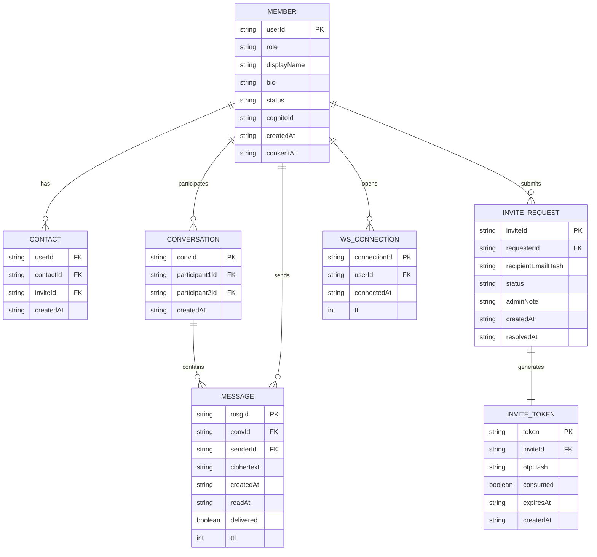

# D-02 — Entity Relationship Diagram / Entitäts-Beziehungsdiagramm

> **EN** DynamoDB single-table design. All entities share one physical table.
> The `PK`/`SK` design patterns drive all access patterns — see the Key Schema
> table below and `docs/srs.md` §8.1.
>
> **DE** DynamoDB Single-Table-Design. Alle Entitäten teilen sich eine physische
> Tabelle. Das vollständige PK/SK-Schema ist unten sowie in `docs/srs.md` §8.1 dokumentiert.

## DynamoDB Key Schema / DynamoDB-Schlüsselschema

| Entity | PK | SK | GSI1PK |
|---|---|---|---|
| Member | `USER#<userId>` | `PROFILE` | `EMAIL#<emailHash>` |
| Contact | `USER#<userId>` | `CONTACT#<contactId>` | — |
| Conversation | `CONV#<convId>` | `METADATA` | `USER#<participant1Id>` |
| Message | `CONV#<convId>` | `MSG#<timestamp>#<msgId>` | — |
| Invite Request | `INVITE#<inviteId>` | `REQUEST` | — |
| Invite Token | `TOKEN#<token>` | `OTP` | — |
| WS Connection | `CONN#<connectionId>` | `USER#<userId>` | — |

## Role Model / Rollenmodell

> **EN** Role is enforced at two layers — Cognito (authoritative, fast) and
> DynamoDB (denormalised, for display/query convenience).
>
> **DE** Die Rolle wird auf zwei Ebenen durchgesetzt — Cognito (maßgeblich,
> schnell) und DynamoDB (denormalisiert, für Anzeige/Abfrage).

| Layer | Mechanism | Purpose |
|---|---|---|
| **Cognito Group** | `Admins` group — `cognito:groups` JWT claim | Source of truth for authorization — checked by `AdminGuard` directly from JWT, no DB read |
| **DynamoDB `MEMBER.role`** | `'admin' \| 'member'` | Denormalised copy — fast display, queryable, never used alone for auth decisions |

**Rules / Regeln:**
- Exactly one Admin exists in MVP — provisioned at deploy time via CDK custom resource, not via normal registration (`UC-01` does not apply to Admin creation)
- `AdminGuard` checks `cognito:groups.includes('Admins')` from the verified JWT — never trusts the DynamoDB `role` field for authorization decisions
- `MEMBER.role` is updated alongside Cognito group changes to prevent drift — single use case (`AssignAdminRole`) updates both atomically
- Regular registration (`UC-01`) always sets `role = 'member'` — there is no self-service path to admin

## Notes / Hinweise
- `ciphertext` is stored as DynamoDB `Binary` type — server never reads content
- `MESSAGE.ttl` — 30-day TTL on undelivered messages only (GDPR FR-2.6); removed once delivered
- `WS_CONNECTION.ttl` — ~2 hour TTL — auto-cleans stale connections
- `INVITE_TOKEN.otpHash` — OTP stored hashed, never plaintext
- `MEMBER.GSI1PK` — enables email lookup without exposing email as primary key
