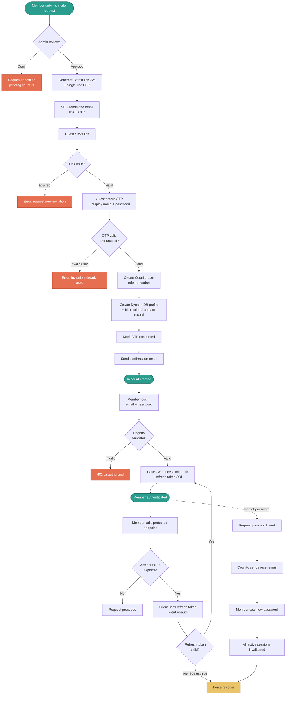

# D-03 — Authentication Flow / Authentifizierungsablauf

> **EN** Complete auth flow: invitation approval, registration, login, token
> refresh, and password reset. Covers UC-01, UC-02, UC-03, FR-1.1–1.7.
>
> **DE** Vollständiger Authentifizierungsablauf: Einladungsgenehmigung,
> Registrierung, Anmeldung, Token-Aktualisierung und Passwort-Zurücksetzung.

## Implementation Notes / Implementierungshinweise

- **Link validity checked before OTP** — fail fast on expired links without prompting for OTP entry
- **Password reset invalidates ALL active sessions** — not just the requesting device — secure default
- **Admin user is never created via this flow** — see `D-02` Role Model — provisioned separately at deploy time
- **Refresh is silent** — client-side interceptor handles token refresh transparently; member never sees a "please log in again" prompt unless the 30-day refresh token itself has expired

## Related Requirements / Verwandte Anforderungen
- FR-1.1 — FR-1.7 (`docs/srs.md` §3.1)
- UC-01, UC-02, UC-03 (`docs/requirements/use-cases.md`)
