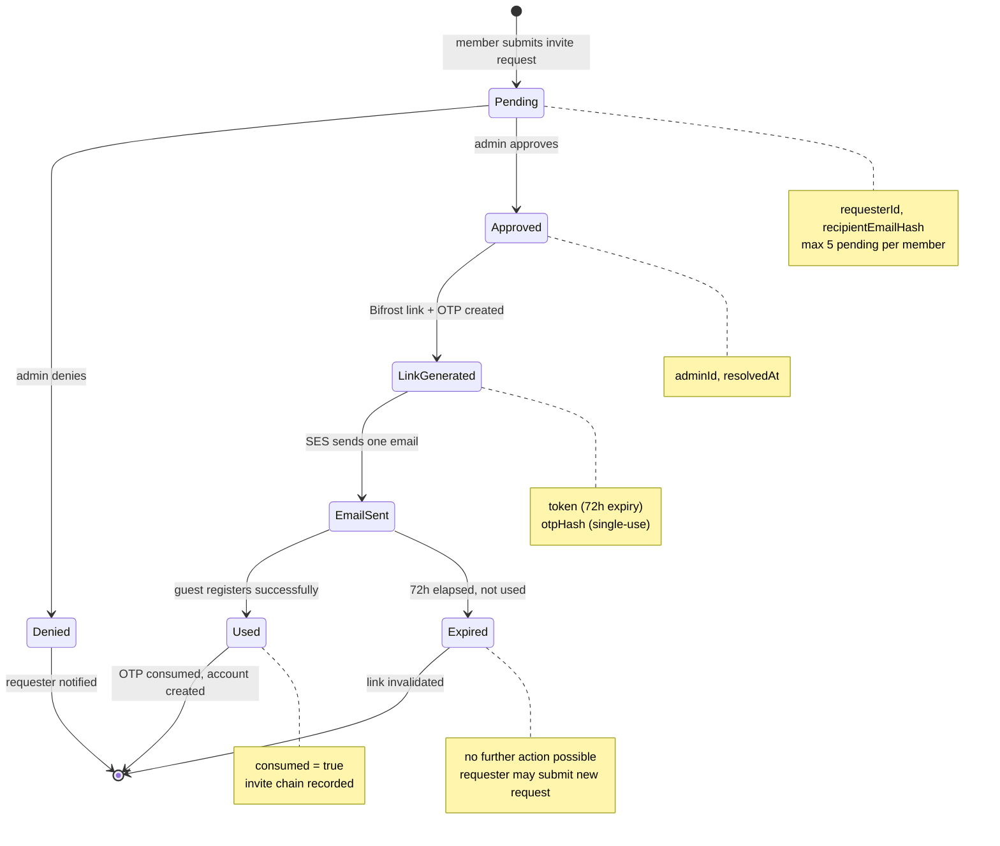

# D-09 — Invitation State Machine / Einladungs-Zustandsautomat

> **EN** Every state an invite request can be in, from submission to
> resolution. Covers FR-1.1–1.3, FR-1.9, FR-1.10.
>
> **DE** Alle Zustände, die eine Einladungsanfrage annehmen kann, von der
> Einreichung bis zur Auflösung.

## Implementation Notes / Implementierungshinweise

- **No retry transition** — `Denied` and `Expired` are dead ends; a new invite request must be submitted from scratch
- **`Denied` frees a pending slot immediately** (FR-1.9); `Expired` does not, since the request was already resolved (approved) before expiring at the link stage
- **`Used` is the only path that creates a `MEMBER` record** — see `D-03` auth flow for what happens after this state is reached

## Related Requirements / Verwandte Anforderungen
FR-1.1 — FR-1.3, FR-1.9, FR-1.10 (`docs/srs.md` §3.1)
