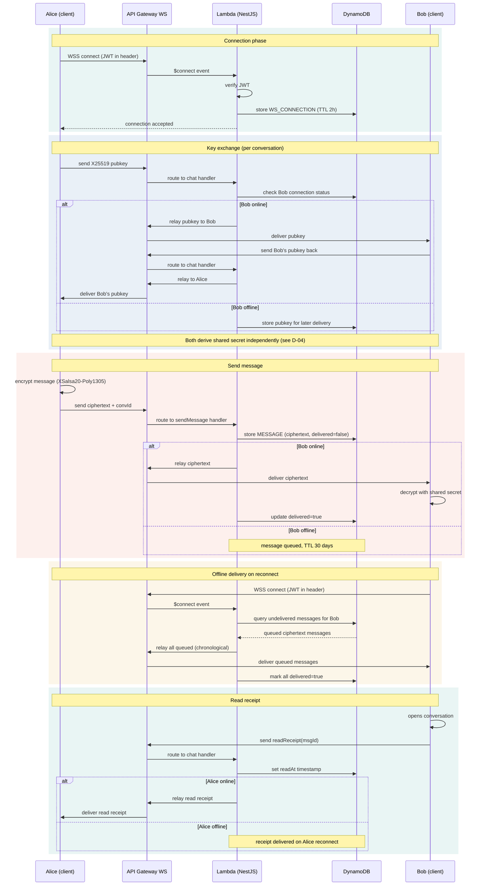

# D-05 — WebSocket Message Flow / WebSocket-Nachrichtenfluss

> **EN** Complete message journey: connection, key exchange, send, relay,
> offline queue, delivery, and read receipts. Covers UC-04, UC-05, FR-2.1–2.9.
>
> **DE** Vollständige Nachrichtenreise: Verbindung, Schlüsselaustausch, Senden,
> Weiterleitung, Offline-Warteschlange, Zustellung und Lesebestätigungen.

## Implementation Notes / Implementierungshinweise

- **One `$connect` handler serves two purposes** — fresh connection AND offline message sync. No separate sync endpoint needed; connecting triggers the queued-message check automatically.
- **Encryption happens entirely client-side** (`A->>A: encrypt message`) — the Lambda layer never has access to plaintext at any point in this flow.
- **Key exchange and message relay share the same online/offline branching pattern** — both check `WS_CONNECTION` existence before deciding to relay live or store-and-forward.
- **`delivered` flag transitions false → true** exactly once, either immediately (online path) or on reconnect (offline path) — never reverts.

## Related Requirements / Verwandte Anforderungen
- FR-2.1 — FR-2.9 (`docs/srs.md` §3.2)
- UC-04 (open conversation), UC-05 (send/receive) — `docs/requirements/use-cases.md`
- See `docs/diagrams/D-04-encryption-flow.md` for the key exchange cryptographic detail
