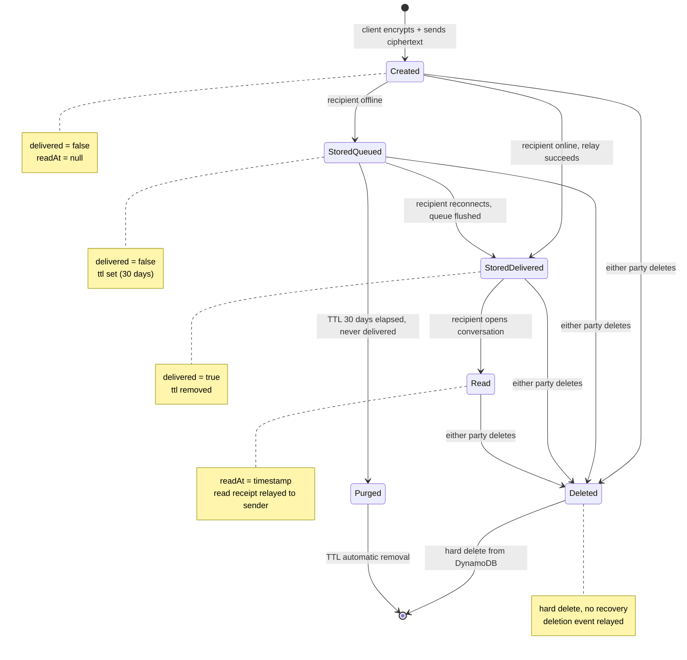

# D-07 — Message State Machine / Nachrichten-Zustandsautomat

> **EN** Every state a message can be in, and every valid transition.
> Covers FR-2.4–2.8.
>
> **DE** Alle Zustände, die eine Nachricht annehmen kann, und alle gültigen
> Übergänge.

## Implementation Notes / Implementierungshinweise

- **Deletion is reachable from every state** — the delete handler must not assume a message has been delivered or read first
- **Two distinct terminal paths** — `Deleted` (explicit user action) vs `Purged` (automatic TTL expiry) — distinguish these in any future audit logging
- **`StoredQueued` → `Purged`** only applies to undelivered messages — once `delivered = true`, TTL is removed and the message persists until explicitly deleted

## Related Requirements / Verwandte Anforderungen
FR-2.4 — FR-2.8 (`docs/srs.md` §3.2)
